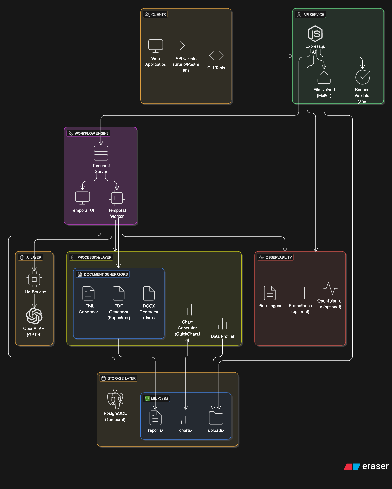

# AI-Powered Report Generator

An intelligent report generation system that transforms structured and unstructured data into professional multi-page reports using AI. Built with TypeScript, Temporal workflows, and OpenAI.

## Features

- **AI-Powered Content Generation**: Uses OpenAI GPT models to generate executive summaries, insights, and recommendations
- **Multiple Report Styles**: Business, Research, and Technical templates with distinct tones and layouts
- **Automatic Visualizations**: Intelligent chart suggestions based on data profiling (line, bar, pie, stacked bar charts)
- **Multiple Output Formats**: Export to PDF, DOCX, or HTML
- **Reliable Workflow Orchestration**: Temporal-based workflows with retries, status tracking, and fault tolerance
- **Data Profiling**: Automatic detection of data types, statistical summaries, and quality scoring

## Architecture



### Components Overview

| Layer                | Components                                     | Description                              |
| -------------------- | ---------------------------------------------- | ---------------------------------------- |
| **Clients**          | Web App, API Clients, CLI                      | User interfaces for report generation    |
| **API Service**      | Express.js, Multer, Zod                        | REST API with file upload and validation |
| **Workflow Engine**  | Temporal Server, Worker, UI                    | Durable workflow orchestration           |
| **Processing Layer** | Data Profiler, Chart Generator, Doc Generators | Data analysis and document creation      |
| **AI Layer**         | LLM Service, OpenAI API                        | AI-powered insight generation            |
| **Storage Layer**    | MinIO/S3, PostgreSQL                           | Object storage and Temporal persistence  |
| **Observability**    | Pino Logger, Prometheus, OpenTelemetry         | Logging and monitoring                   |

## Prerequisites

- Node.js 20+
- Docker & Docker Compose
- OpenAI API Key

## Quick Start

### 1. Clone and Install Dependencies

```bash
cd report-generation
npm install
```

### 2. Configure Environment

```bash
cp env.example .env
```

Edit `.env` and add your OpenAI API key:

```env
OPENAI_API_KEY=sk-your-api-key-here
```

### 3. Start Temporal Server

```bash
docker-compose up -d
```

Wait for Temporal to be healthy (check at http://localhost:8080).

### 4. Start the Worker

```bash
npm run worker:dev
```

### 5. Start the API Server

In a new terminal:

```bash
npm run dev
```

The API will be available at http://localhost:3000.

### 6. Access API Documentation

Interactive Swagger documentation is available at:

- **Swagger UI**: http://localhost:3000/api/docs
- **OpenAPI JSON**: http://localhost:3000/api/docs/json
- **OpenAPI YAML**: http://localhost:3000/api/docs/yaml

The OpenAPI specification is maintained in the `swagger/` folder and is separate from the codebase.

## API Documentation

### Interactive Documentation

The API includes comprehensive Swagger/OpenAPI documentation:

- **Swagger UI**: Visit http://localhost:3000/api/docs for interactive API documentation
- **OpenAPI Spec**: Available at http://localhost:3000/api/docs/json (JSON) or `/api/docs/yaml` (YAML)

The OpenAPI specification is maintained separately in the `swagger/` folder and is not embedded in the code.

## API Reference

### Create Report

**POST** `/api/reports`

Create a new report from structured/unstructured data.

```bash
curl -X POST http://localhost:3000/api/reports \
  -H "Content-Type: application/json" \
  -d '{
    "data": [
      {
        "type": "structured",
        "format": "json",
        "data": [
          {"month": "January", "revenue": 45000, "customers": 120},
          {"month": "February", "revenue": 52000, "customers": 145},
          {"month": "March", "revenue": 48000, "customers": 132}
        ]
      }
    ],
    "config": {
      "title": "Q1 Business Report",
      "style": "business",
      "outputFormats": ["PDF", "HTML"]
    }
  }'
```

**Response:**

```json
{
  "reportId": "abc123xyz",
  "workflowId": "report-abc123xyz",
  "status": "QUEUED",
  "statusUrl": "/reports/abc123xyz"
}
```

### Upload Files

**POST** `/api/reports/upload`

Create a report from file uploads (CSV, JSON, text, markdown).

```bash
curl -X POST http://localhost:3000/api/reports/upload \
  -F "files=@data.csv" \
  -F "title=Sales Analysis Report" \
  -F "style=business" \
  -F "outputFormats=PDF,HTML"
```

### Get Report Status

**GET** `/api/reports/:reportId`

```bash
curl http://localhost:3000/api/reports/abc123xyz
```

**Response:**

```json
{
  "id": "abc123xyz",
  "title": "Q1 Business Report",
  "style": "business",
  "status": "COMPLETED",
  "progress": 100,
  "files": [
    {
      "format": "PDF",
      "url": "/reports/abc123xyz/files?format=PDF",
      "size": 245678
    }
  ]
}
```

### Download Report

**GET** `/api/reports/:reportId/files?format=PDF|DOCX|HTML`

```bash
curl -O http://localhost:3000/api/reports/abc123xyz/files?format=PDF
```

### List All Reports

**GET** `/api/reports`

```bash
curl http://localhost:3000/api/reports
```

### Cancel Report

**POST** `/api/reports/:reportId/cancel`

```bash
curl -X POST http://localhost:3000/api/reports/abc123xyz/cancel
```

## Report Styles

### Business Style

- **Tone**: Concise, executive-friendly
- **Sections**: Executive Summary, KPIs, Trends, Risks, Recommendations
- **Best for**: Monthly reports, stakeholder updates, performance reviews

### Research Style

- **Tone**: Formal, academic
- **Sections**: Abstract, Introduction, Methodology, Results, Discussion, Conclusion
- **Best for**: Research papers, analysis reports, white papers

### Technical Style

- **Tone**: Detailed, engineering-focused
- **Sections**: Overview, System Metrics, Performance Analysis, Error Analysis, Recommendations
- **Best for**: Technical reports, incident reports, system documentation

## Input Data Formats

### Structured Data (JSON)

```json
{
  "type": "structured",
  "format": "json",
  "data": [
    { "date": "2024-01-01", "metric": 100, "category": "A" },
    { "date": "2024-01-02", "metric": 150, "category": "B" }
  ]
}
```

### Structured Data (CSV)

```json
{
  "type": "structured",
  "format": "csv",
  "data": "date,metric,category\n2024-01-01,100,A\n2024-01-02,150,B"
}
```

### Unstructured Data

```json
{
  "type": "unstructured",
  "format": "text",
  "content": "Additional context and notes about the data..."
}
```

## Configuration Options

### Report Config

```typescript
{
  title: string;              // Report title (required)
  style: 'business' | 'research' | 'technical';
  outputFormats: ('PDF' | 'DOCX' | 'HTML')[];
  branding?: {
    logoUrl?: string;
    primaryColor?: string;    // e.g., "#1a365d"
    secondaryColor?: string;
    accentColor?: string;
    fontFamily?: string;
    companyName?: string;
  };
  sectionsToInclude?: string[];
  sectionsToExclude?: string[];
  authorName?: string;
  customPromptInstructions?: string;
}
```

## Workflow States

| Status               | Description                               |
| -------------------- | ----------------------------------------- |
| `QUEUED`             | Report request received, waiting to start |
| `DATA_PROFILING`     | Analyzing and profiling input data        |
| `INSIGHT_GENERATION` | AI generating narrative content           |
| `CHART_GENERATION`   | Creating visualizations                   |
| `LAYOUT_RENDERING`   | Assembling report layout                  |
| `EXPORTING`          | Converting to requested formats           |
| `COMPLETED`          | Report ready for download                 |
| `FAILED`             | Error occurred during generation          |

## Development

### Project Structure

```
src/
├── api/
│   └── routes.ts           # Express API routes
├── config/
│   └── index.ts            # Configuration management
├── services/
│   ├── data-profiler.ts    # Data analysis and profiling
│   ├── openai-service.ts   # OpenAI integration
│   ├── chart-generator.ts  # Chart creation
│   ├── pdf-generator.ts    # PDF export
│   └── docx-generator.ts   # DOCX export
├── templates/
│   ├── styles.ts           # Report style configurations
│   └── html-generator.ts   # HTML report generation
├── temporal/
│   ├── activities.ts       # Temporal activities
│   ├── workflows.ts        # Temporal workflows
│   ├── worker.ts           # Temporal worker
│   └── client.ts           # Temporal client
├── types/
│   └── index.ts            # TypeScript types
├── utils/
│   ├── logger.ts           # Logging utility
│   └── storage.ts          # File storage
└── index.ts                # Application entry point
```

### Scripts

```bash
npm run dev          # Start API server in development mode
npm run worker:dev   # Start Temporal worker in development mode
npm run build        # Build TypeScript
npm run start        # Start production server
npm run lint         # Run ESLint
npm run format       # Format code with Prettier
npm run test         # Run tests
```

### Temporal UI

Access the Temporal Web UI at http://localhost:8080 to:

- Monitor workflow executions
- View workflow history
- Debug failed workflows
- Query workflow state

## Production Deployment

### Environment Variables

| Variable             | Description             | Default        |
| -------------------- | ----------------------- | -------------- |
| `PORT`               | API server port         | 3000           |
| `NODE_ENV`           | Environment             | development    |
| `OPENAI_API_KEY`     | OpenAI API key          | (required)     |
| `OPENAI_MODEL`       | GPT model to use        | gpt-4o         |
| `TEMPORAL_ADDRESS`   | Temporal server address | localhost:7233 |
| `TEMPORAL_NAMESPACE` | Temporal namespace      | default        |
| `STORAGE_PATH`       | Base storage directory  | ./storage      |
| `LOG_LEVEL`          | Logging level           | info           |

### Docker Deployment

Build and run with Docker:

```bash
# Build the image
docker build -t report-generator .

# Run with environment variables
docker run -p 3000:3000 \
  -e OPENAI_API_KEY=sk-your-key \
  -e TEMPORAL_ADDRESS=temporal:7233 \
  -v ./storage:/app/storage \
  report-generator
```

### Scaling

- **API Servers**: Scale horizontally behind a load balancer
- **Temporal Workers**: Add more worker instances for increased throughput
- **Storage**: Use cloud object storage (S3, GCS) for production

## Troubleshooting

### Temporal Connection Failed

Ensure Temporal is running:

```bash
docker-compose ps
docker-compose logs temporal
```

### OpenAI Rate Limits

The system uses retry logic with exponential backoff. For high volume:

- Use a higher-tier OpenAI plan
- Implement request queuing
- Consider using Azure OpenAI

### PDF Generation Issues

Ensure Puppeteer dependencies are installed:

```bash
# macOS
brew install chromium

# Ubuntu/Debian
apt-get install chromium-browser
```

## Upcoming Features

The following features are planned for the next version:

### Access Control & Role-Based Permissions

- **Role-Based Access Control (RBAC)**: Implement user roles (Admin, Editor, Viewer) with granular permissions
- **User Management**: User registration, authentication, and profile management

### Report Sharing & Collaboration

- **Share Reports**: Share reports with specific users or user groups
- **Access Control Lists**: Manage who can view, download, or edit shared reports
- **Public Links**: Generate shareable links with optional expiration and password protection
- **Collaboration Features**: Comments, annotations, and version history for reports

### Human-in-the-Loop (HIL) Approval Workflow

- **Admin Approval Workflow**: All generated reports require admin approval before being accessible to other users
- **Review Queue**: Admins can view and manage a queue of pending reports awaiting approval
- **Approval Actions**: Admins can approve or reject reports with optional comments
- **Notifications**:
  - Report creators receive notifications when their reports are:
    - Submitted for review
    - Approved (with optional admin comments)
    - Rejected (with rejection reason/comments)
  - Admins receive notifications when new reports are submitted for review
- **Status Tracking**: Reports have additional statuses:
  - `PENDING_APPROVAL` - Awaiting admin review
  - `APPROVED` - Approved and accessible to authorized users
  - `REJECTED` - Rejected with reason, visible only to creator and admins
- **Revision Workflow**: Rejected reports can be revised and resubmitted for approval
